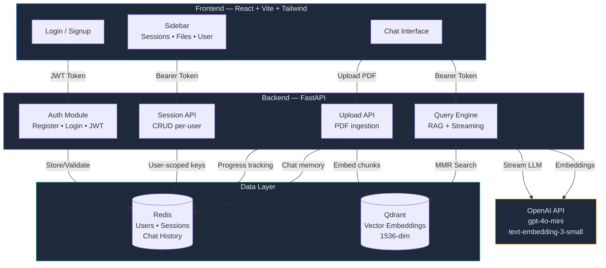
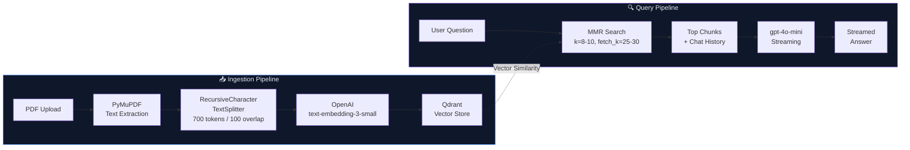
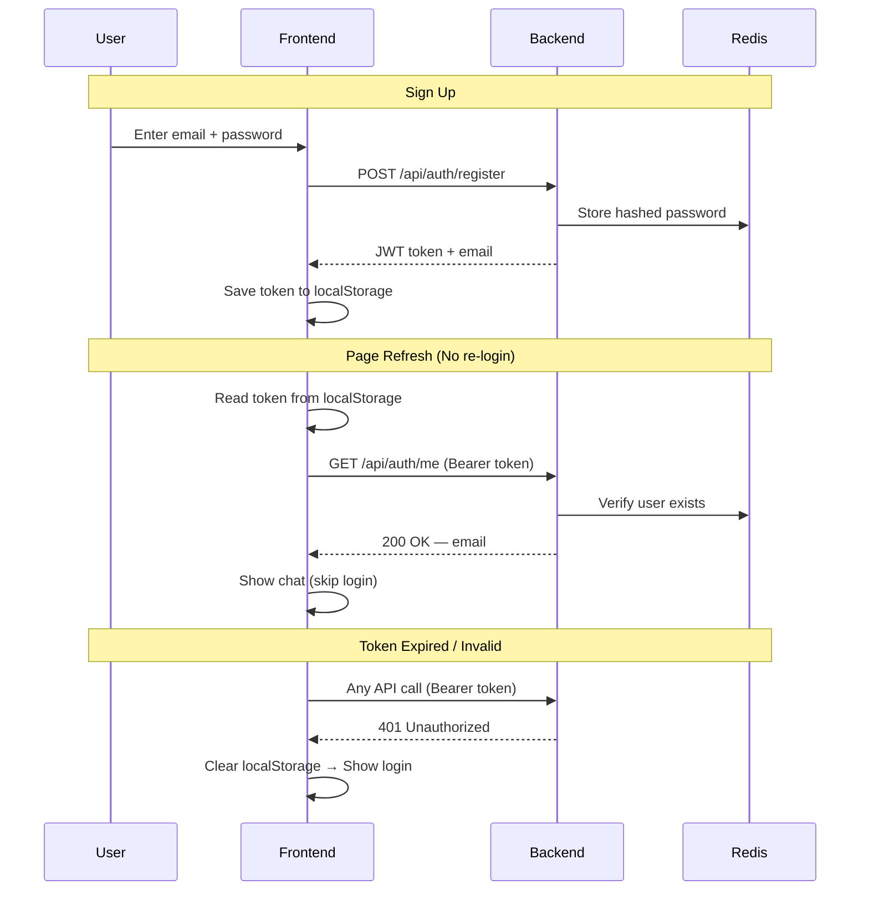
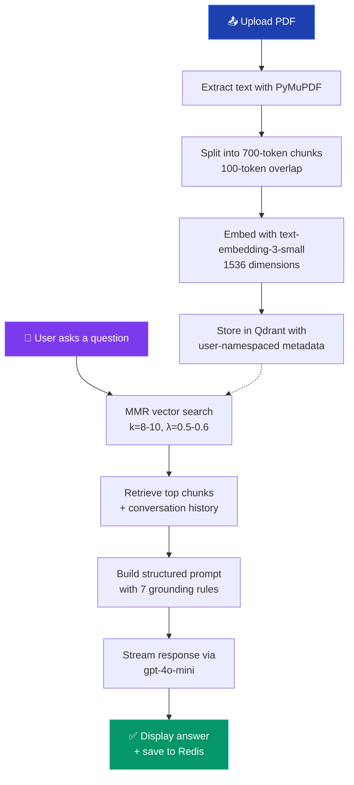

# 🧠 DocMind — Multi-PDF Q&A Intelligence Platform

> An AI-powered document intelligence platform with user authentication. Upload multiple PDFs and have deep, context-aware conversations across all of them — with per-user data isolation.


---

## ✨ Features

- **🔐 User Authentication** — Email/password signup & login with JWT tokens (30-day sessions)
- **👤 Per-User Data Isolation** — Every user's PDFs, chat history, and vector data are fully siloed
- **📄 Multi-PDF Upload** — Upload and index multiple PDF documents at once
- **🎯 Selective Document Querying** — Choose specific files to query, or ask across all uploaded documents
- **⚡ Streaming AI Responses** — Answers stream in real-time using OpenAI `gpt-4o-mini`
- **🧠 Persistent Session Memory** — Conversations are stored per-session with hybrid memory (Redis)
- **📊 Real-Time Ingestion Progress** — Live progress bar tracking as PDFs are chunked and embedded
- **🔍 MMR Retrieval** — Maximal Marginal Relevance ensures diverse, high-quality chunks from the vector DB
- **📚 Multi-Document Attribution** — Clearly attributes answers to the correct source document(s)
- **💬 Session Management** — Create, auto-title, and delete chat sessions
- **🐳 Docker Support** — Full Docker Compose setup with Redis and Qdrant included

---

## 🏗️ System Architecture



---

## 🔄 RAG Pipeline



---

## 🔐 Authentication Flow



---

## 🗄️ Data Isolation per User

```mermaid
graph LR
    subgraph UserA["User A — alice@email.com"]
        A_SESS["docmind:sessions:alice@email.com"]
        A_FILES["docmind:files:alice@email.com"]
        A_HIST["docmind:recent:alice@email.com:sid_001"]
        A_VEC["Qdrant: a1b2c3d4__resume.pdf"]
    end

    subgraph UserB["User B — bob@email.com"]
        B_SESS["docmind:sessions:bob@email.com"]
        B_FILES["docmind:files:bob@email.com"]
        B_HIST["docmind:recent:bob@email.com:sid_002"]
        B_VEC["Qdrant: e5f6g7h8__contract.pdf"]
    end

    UserA x--x UserB

    style UserA fill:#0f172a,stroke:#3b82f6,color:#e2e8f0
    style UserB fill:#0f172a,stroke:#10b981,color:#e2e8f0
```



> Every Redis key and Qdrant vector is namespaced by user email or email hash. User A **cannot** see, query, or access User B's data.

---

## 🛠️ Tech Stack

| Layer | Technology |
|---|---|
| **Frontend** | React 19, Vite, Tailwind CSS v4, Framer Motion, Lucide React |
| **Backend** | FastAPI, Python 3.11, Uvicorn |
| **Auth** | Email/Password, SHA-256 hashing, PyJWT (30-day tokens) |
| **LLM** | OpenAI `gpt-4o-mini` (streaming) |
| **Embeddings** | OpenAI `text-embedding-3-small` (1536 dimensions) |
| **Vector DB** | Qdrant (Docker or Qdrant Cloud) |
| **Session Store** | Redis (Docker, local, or Upstash) |
| **PDF Parsing** | PyMuPDF |
| **Text Splitting** | LangChain `RecursiveCharacterTextSplitter` |
| **Containerization** | Docker + Docker Compose |

---

## 📁 Project Structure

```
multi-pdf-qna/
├── backend/
│   ├── main.py              # FastAPI app — auth, sessions, upload, query APIs
│   ├── ingestion.py         # PDF parsing, chunking, embedding pipeline
│   ├── query.py             # RAG engine — MMR retrieval, prompt, streaming
│   ├── database.py          # Qdrant client + collection bootstrapping
│   └── requirements.txt     # Backend Python dependencies
├── frontend/
│   ├── src/
│   │   ├── App.jsx          # Main app — auth state, routing, API calls
│   │   ├── main.jsx         # React entry point
│   │   └── components/
│   │       ├── Login.jsx    # Login / Signup UI
│   │       ├── Sidebar.jsx  # Sessions, files, user email, sign out
│   │       ├── Header.jsx   # Top bar with upload button
│   │       ├── ChatInput.jsx    # Message input with Enter-to-send
│   │       └── MessageList.jsx  # Chat messages with markdown rendering
│   ├── index.html           # HTML shell with SEO meta tags
│   ├── package.json         # Frontend dependencies
│   └── vite.config.js       # Vite + Tailwind configuration
├── Dockerfile               # Backend Docker image
├── docker-compose.yml       # Full stack: backend + Redis + Qdrant
├── requirements.txt         # Root-level Python dependencies (for Render)
├── .env.example             # Environment variable template
└── .gitignore
```

---

## 🚀 Getting Started

### Prerequisites

- Python 3.11+
- Node.js 18+
- Docker & Docker Compose *(optional)*
- An [OpenAI API Key](https://platform.openai.com/api-keys)

---

### Option 1: Docker Compose (Recommended)

```bash
# 1. Clone
git clone https://github.com/jenish102002/DocMind.git
cd DocMind/multi-pdf-qna

# 2. Configure
cp .env.example .env
# Edit .env → add your OPENAI_API_KEY

# 3. Start backend + Redis + Qdrant
docker-compose up --build

# 4. Start frontend (in a new terminal)
cd frontend
npm install
npm run dev
```

Open `http://localhost:5173` → Sign up → Upload a PDF → Start chatting!

---

### Option 2: Manual Setup

```bash
# 1. Start Qdrant
docker run -p 6333:6333 qdrant/qdrant

# 2. Start Redis
docker run -p 6379:6379 redis:alpine

# 3. Backend
cd backend
python -m venv venv
source venv/bin/activate
pip install -r ../requirements.txt
uvicorn main:app --reload --host 0.0.0.0 --port 8000

# 4. Frontend (new terminal)
cd frontend
npm install
npm run dev
```

---

### Option 3: Cloud Services (Production)

Use managed cloud services — no Docker needed:

| Service | Provider | Setup |
|---|---|---|
| **Redis** | [Upstash](https://upstash.com) | Create DB → copy `rediss://` URL |
| **Qdrant** | [Qdrant Cloud](https://cloud.qdrant.io) | Create cluster → copy URL + API key |
| **Backend** | [Render](https://render.com) | Connect GitHub → set env vars |
| **Frontend** | [Vercel](https://vercel.com) | Connect GitHub → set `VITE_API_URL` |

---

## ⚙️ Environment Variables

### Backend (`.env`)

| Variable | Description | Default |
|---|---|---|
| `OPENAI_API_KEY` | Your OpenAI API key | *(required)* |
| `OPENAI_LLM_MODEL` | LLM model name | `gpt-4o-mini` |
| `OPENAI_EMBEDDINGS_MODEL` | Embeddings model name | `text-embedding-3-small` |
| `REDIS_URL` | Redis connection string (`rediss://` for TLS) | `redis://localhost:6379` |
| `QDRANT_URL` | Qdrant instance URL | `http://localhost:6333` |
| `QDRANT_API_KEY` | Qdrant Cloud API key | `None` |
| `JWT_SECRET` | Secret key for JWT signing | *(required in production)* |
| `FRONTEND_URL` | Frontend origin for CORS | `http://localhost:5173` |

### Frontend (`frontend/.env`)

| Variable | Description |
|---|---|
| `VITE_API_URL` | Backend API URL (e.g., `https://your-backend.onrender.com`) |

---

## 📡 API Reference

### Auth Endpoints (public)

| Method | Endpoint | Description |
|---|---|---|
| `POST` | `/api/auth/register` | Create account (email + password) |
| `POST` | `/api/auth/login` | Login and receive JWT |
| `GET` | `/api/auth/me` | Validate JWT token |

### Protected Endpoints (require `Authorization: Bearer <token>`)

| Method | Endpoint | Description |
|---|---|---|
| `GET` | `/api/sessions` | List user's chat sessions |
| `POST` | `/api/sessions` | Create a new session |
| `DELETE` | `/api/sessions/{id}` | Delete a session + history |
| `GET` | `/api/history/{session_id}` | Get chat history |
| `GET` | `/api/files` | List uploaded files |
| `POST` | `/api/upload` | Upload a PDF (multipart/form-data) |
| `GET` | `/api/upload/status/{filename}` | Poll ingestion progress |
| `DELETE` | `/api/files/{filename}` | Delete file from storage + vectors |
| `POST` | `/api/query` | Ask a question (streams response) |

**Query Request Body:**
```json
{
  "query": "What are the key findings in the report?",
  "session_id": "sid_1234567890",
  "selected_files": ["report_q4.pdf"]
}
```

> Pass `[]` for `selected_files` to query across **all** uploaded documents.

---

## 🧩 How It Works



---

## ☁️ Cloud Deployment

### Backend (Render)

1. Create a **Web Service** on Render
2. Connect your GitHub repo
3. Set **Root Directory**: *(leave blank)*
4. Set **Build Command**: `pip install -r requirements.txt`
5. Set **Start Command**: `cd backend && uvicorn main:app --host 0.0.0.0 --port $PORT`
6. Add all env vars from the table above

### Frontend (Vercel)

1. Import the repo on Vercel
2. Set **Root Directory**: `frontend`
3. Set **Framework Preset**: Vite
4. Add env var: `VITE_API_URL` = your Render backend URL

---

## 🤝 Contributing

Contributions are welcome! Feel free to open an issue or submit a pull request.

1. Fork the repository
2. Create a feature branch: `git checkout -b feature/your-feature`
3. Commit your changes: `git commit -m 'Add your feature'`
4. Push and open a Pull Request

---

## 📄 License

This project is licensed under the MIT License.

---

*Built with ❤️ using OpenAI, Qdrant, FastAPI, and React.*