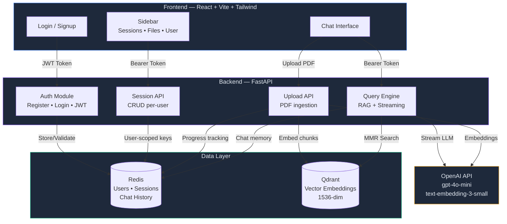
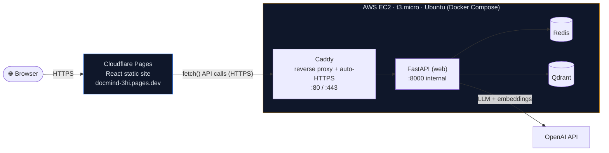
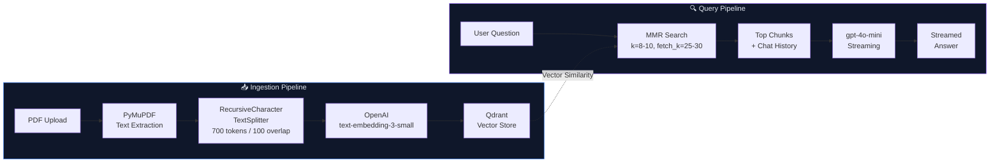
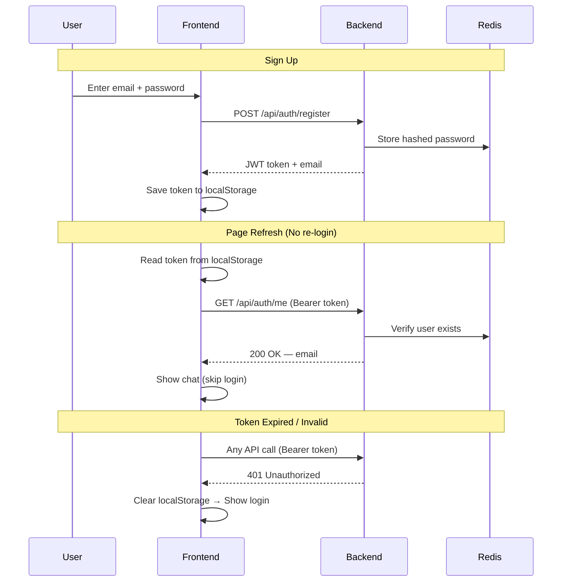

# 🧠 DocMind — Multi-PDF Q&A Intelligence Platform

> An AI-powered document intelligence platform with user authentication. Upload multiple PDFs and have deep, context-aware conversations across all of them — with per-user data isolation.

### 🔗 Live demo: **[docmind-3hi.pages.dev](https://docmind-3hi.pages.dev)**


---

## ✨ Features

- **🔐 User Authentication** — Email/password signup & login with JWT tokens (30-day sessions)
- **👤 Per-User Data Isolation** — Every user's PDFs, chat history, and vector data are fully siloed
- **📄 Multi-PDF Upload** — Upload and index multiple PDF documents, with drag-and-drop
- **🎯 Selective Document Querying** — Choose specific files to query, or ask across all uploaded documents
- **⚡ Streaming AI Responses** — Answers stream in real-time using OpenAI `gpt-4o-mini`
- **🧠 Persistent Session Memory** — Conversations are stored per-session with hybrid memory (Redis)
- **📊 Real-Time Ingestion Progress** — Live progress bar tracking as PDFs are chunked and embedded
- **🔍 MMR Retrieval** — Maximal Marginal Relevance ensures diverse, high-quality chunks from the vector DB
- **💬 Session Management** — Create, auto-title, and delete chat sessions
- **🐳 Dockerized** — Full Docker Compose stack (FastAPI + Redis + Qdrant + Caddy)
- **🔄 CI/CD** — Push to `main` auto-deploys the backend to AWS EC2 and the frontend to Cloudflare Pages

---

## 🏗️ System Architecture


```mermaid
graph TB
    subgraph Frontend["Frontend — React + Vite + Tailwind"]
        LOGIN["Login / Signup"]
        CHAT["Chat Interface"]
        SIDEBAR["Sidebar<br/>Sessions • Files • User"]
    end

    subgraph Backend["Backend — FastAPI"]
        AUTH["Auth Module<br/>Register • Login • JWT"]
        SESSIONS["Session API<br/>CRUD per-user"]
        UPLOAD["Upload API<br/>PDF ingestion"]
        QUERY["Query Engine<br/>RAG + Streaming"]
    end

    subgraph Storage["Data Layer"]
        REDIS[("Redis<br/>Users • Sessions<br/>Chat History")]
        QDRANT[("Qdrant<br/>Vector Embeddings<br/>1536-dim")]
    end

    OPENAI["OpenAI API<br/>gpt-4o-mini<br/>text-embedding-3-small"]

    LOGIN -->|JWT Token| AUTH
    CHAT -->|Bearer Token| QUERY
    SIDEBAR -->|Bearer Token| SESSIONS
    CHAT -->|Upload PDF| UPLOAD

    AUTH -->|Store/Validate| REDIS
    SESSIONS -->|User-scoped keys| REDIS
    UPLOAD -->|Embed chunks| QDRANT
    UPLOAD -->|Progress tracking| REDIS
    QUERY -->|MMR Search| QDRANT
    QUERY -->|Chat memory| REDIS
    QUERY -->|Stream LLM| OPENAI
    UPLOAD -->|Embeddings| OPENAI

    style Frontend fill:#1e293b,stroke:#3b82f6,color:#e2e8f0
    style Backend fill:#1e293b,stroke:#8b5cf6,color:#e2e8f0
    style Storage fill:#1e293b,stroke:#10b981,color:#e2e8f0
    style OPENAI fill:#1e293b,stroke:#f59e0b,color:#e2e8f0
```

---

## ☁️ Deployment Architecture

The live app runs the **frontend on Cloudflare Pages** and the **backend + both databases on a single AWS EC2 instance**, containerized with Docker Compose behind Caddy (which provides automatic HTTPS).


```mermaid
graph LR
    USER(["🌐 Browser"]) -->|HTTPS| CF["Cloudflare Pages<br/>React static site<br/>docmind-3hi.pages.dev"]
    CF -->|"fetch() API calls (HTTPS)"| CADDY

    subgraph EC2["AWS EC2 · t3.micro · Ubuntu (Docker Compose)"]
        CADDY["Caddy<br/>reverse proxy + auto-HTTPS<br/>:80 / :443"] --> WEB["FastAPI (web)<br/>:8000 internal"]
        WEB --> REDIS[("Redis")]
        WEB --> QDRANT[("Qdrant")]
    end

    WEB -->|LLM + embeddings| OPENAI["OpenAI API"]

    style EC2 fill:#0f172a,stroke:#f59e0b,color:#e2e8f0
    style CF fill:#0f172a,stroke:#3b82f6,color:#e2e8f0
```

**CI/CD:** a push to `main` triggers two independent deploys — Cloudflare Pages rebuilds the frontend, and a **GitHub Actions** workflow (`.github/workflows/deploy.yml`) SSHes into EC2, syncs the repo, and rebuilds the container stack. See **[DEPLOY_AWS.md](DEPLOY_AWS.md)** for the full step-by-step guide and **[docs/DEPLOYMENT_EXPLAINED.md](docs/DEPLOYMENT_EXPLAINED.md)** for the architecture deep-dive.

---

## 🔄 RAG Pipeline


```mermaid
flowchart LR
    subgraph Ingestion["📥 Ingestion Pipeline"]
        PDF["PDF Upload"] --> EXTRACT["PyMuPDF<br/>Text Extraction"]
        EXTRACT --> CHUNK["RecursiveCharacter<br/>TextSplitter<br/>700 tokens / 100 overlap"]
        CHUNK --> EMBED["OpenAI<br/>text-embedding-3-small"]
        EMBED --> STORE["Qdrant<br/>Vector Store"]
    end

    subgraph Query["🔍 Query Pipeline"]
        USER_Q["User Question"] --> MMR["MMR Search<br/>k=8-10, fetch_k=25-30"]
        MMR --> CONTEXT["Top Chunks<br/>+ Chat History"]
        CONTEXT --> LLM["gpt-4o-mini<br/>Streaming"]
        LLM --> ANSWER["Streamed<br/>Answer"]
    end

    STORE -.->|Vector Similarity| MMR

    style Ingestion fill:#0f172a,stroke:#3b82f6,color:#e2e8f0
    style Query fill:#0f172a,stroke:#8b5cf6,color:#e2e8f0
```

---

## 🔐 Authentication Flow


```mermaid
sequenceDiagram
    participant U as User
    participant F as Frontend
    participant B as Backend
    participant R as Redis

    Note over U,R: Sign Up
    U->>F: Enter email + password
    F->>B: POST /api/auth/register
    B->>R: Store hashed password
    B-->>F: JWT token + email
    F->>F: Save token to localStorage

    Note over U,R: Page Refresh (No re-login)
    F->>F: Read token from localStorage
    F->>B: GET /api/auth/me (Bearer token)
    B->>R: Verify user exists
    B-->>F: 200 OK — email
    F->>F: Show chat (skip login)

    Note over U,R: Token Expired / Invalid
    F->>B: Any API call (Bearer token)
    B-->>F: 401 Unauthorized
    F->>F: Clear localStorage → Show login
```

---

## 🗄️ Data Isolation per User


```mermaid
graph LR
    subgraph UserA["User A — alice@email.com"]
        A_SESS["docmind:sessions:alice@email.com"]
        A_FILES["docmind:files:alice@email.com"]
        A_HIST["docmind:recent:alice@email.com:sid_001"]
        A_VEC["Qdrant: a1b2c3d4__resume.pdf"]
    end

    subgraph UserB["User B — bob@email.com"]
        B_SESS["docmind:sessions:bob@email.com"]
        B_FILES["docmind:files:bob@email.com"]
        B_HIST["docmind:recent:bob@email.com:sid_002"]
        B_VEC["Qdrant: e5f6g7h8__contract.pdf"]
    end

    UserA x--x UserB

    style UserA fill:#0f172a,stroke:#3b82f6,color:#e2e8f0
    style UserB fill:#0f172a,stroke:#10b981,color:#e2e8f0
```

> Every Redis key and Qdrant vector is namespaced by user email or email hash. User A **cannot** see, query, or access User B's data.

---

## 🛠️ Tech Stack

| Layer | Technology |
|---|---|
| **Frontend** | React 19, Vite, Tailwind CSS v4, Framer Motion, Lucide React |
| **Backend** | FastAPI, Python 3.11, Uvicorn |
| **Auth** | Email/Password, SHA-256 hashing, PyJWT (30-day tokens) |
| **LLM** | OpenAI `gpt-4o-mini` (streaming) |
| **Embeddings** | OpenAI `text-embedding-3-small` (1536 dimensions) |
| **Vector DB** | Qdrant (self-hosted container) |
| **Session Store** | Redis (self-hosted container) |
| **PDF Parsing** | PyMuPDF |
| **Text Splitting** | LangChain `RecursiveCharacterTextSplitter` |
| **Reverse proxy / HTTPS** | Caddy (automatic Let's Encrypt) |
| **Frontend hosting** | Cloudflare Pages |
| **Backend hosting** | AWS EC2 (Docker Compose) |
| **CI/CD** | GitHub Actions (auto-deploy on push to `main`) |

---

## 📁 Project Structure

```
DocMind/
├── backend/
│   ├── main.py               # FastAPI app — auth, sessions, upload, query APIs
│   ├── ingestion.py          # PDF parsing, chunking, embedding pipeline
│   ├── query.py              # RAG engine — MMR retrieval, prompt, streaming
│   └── database.py           # Qdrant client + collection bootstrapping
├── frontend/
│   ├── src/
│   │   ├── App.jsx           # Main app — auth state, routing, API calls
│   │   ├── main.jsx          # React entry point
│   │   ├── index.css         # Tailwind theme + styles
│   │   └── components/
│   │       ├── Login.jsx     # Login / Signup UI
│   │       ├── Sidebar.jsx   # Sessions, files, user email, sign out
│   │       ├── Header.jsx    # Top bar with upload button
│   │       ├── ChatInput.jsx     # Message input with Enter-to-send
│   │       └── MessageList.jsx   # Chat messages + stateful empty state
│   ├── index.html            # HTML shell with SEO meta tags
│   ├── package.json          # Frontend dependencies
│   └── vite.config.js        # Vite + Tailwind configuration
├── deploy/                   # Production deployment (single EC2 box)
│   ├── docker-compose.prod.yml   # Caddy + FastAPI + Redis + Qdrant
│   ├── Caddyfile             # Reverse proxy + automatic HTTPS
│   └── env.prod.example      # Server env template
├── .github/workflows/deploy.yml  # CI/CD — auto-deploy backend to EC2
├── Dockerfile                # Backend Docker image
├── docker-compose.yml        # Local dev stack (backend + Redis + Qdrant)
├── requirements.txt          # Python dependencies
├── DEPLOY_AWS.md             # Step-by-step AWS + Cloudflare deployment guide
├── docs/DEPLOYMENT_EXPLAINED.md  # Architecture deep-dive
├── .env.example              # Environment variable template
└── .gitignore
```

---

## 🚀 Getting Started (Local)

### Prerequisites

- Python 3.11+
- Node.js 20+
- Docker & Docker Compose *(optional, recommended)*
- An [OpenAI API Key](https://platform.openai.com/api-keys)

### Option 1: Docker Compose (recommended)

```bash
# 1. Clone
git clone https://github.com/jenish102002/DocMind.git
cd DocMind

# 2. Configure
cp .env.example .env
# Edit .env → add your OPENAI_API_KEY

# 3. Start backend + Redis + Qdrant
docker-compose up --build

# 4. Start frontend (in a new terminal)
cd frontend
npm install
npm run dev
```

Open `http://localhost:5173` → Sign up → Upload a PDF → Start chatting!

### Option 2: Manual Setup

```bash
# 1. Start Qdrant + Redis
docker run -p 6333:6333 qdrant/qdrant
docker run -p 6379:6379 redis:alpine

# 2. Backend
cd backend
python -m venv venv
source venv/bin/activate
pip install -r ../requirements.txt
uvicorn main:app --reload --host 0.0.0.0 --port 8000

# 3. Frontend (new terminal)
cd frontend
npm install
npm run dev
```

---

## ⚙️ Environment Variables

### Backend (`.env`)

| Variable | Description | Default |
|---|---|---|
| `OPENAI_API_KEY` | Your OpenAI API key | *(required)* |
| `OPENAI_LLM_MODEL` | LLM model name | `gpt-4o-mini` |
| `OPENAI_EMBEDDINGS_MODEL` | Embeddings model name | `text-embedding-3-small` |
| `REDIS_URL` | Redis connection string (`rediss://` for TLS) | `redis://localhost:6379` |
| `QDRANT_URL` | Qdrant instance URL | `http://localhost:6333` |
| `QDRANT_API_KEY` | Qdrant API key (if using a secured instance) | `None` |
| `JWT_SECRET` | Secret key for JWT signing | *(required in production)* |
| `FRONTEND_URL` | Frontend origin for CORS | `http://localhost:5173` |

### Frontend

| Variable | Description |
|---|---|
| `VITE_API_URL` | Backend API URL (e.g., `https://docmind-jenish.duckdns.org`) |

---

## 📡 API Reference

### Auth Endpoints (public)

| Method | Endpoint | Description |
|---|---|---|
| `POST` | `/api/auth/register` | Create account (email + password) |
| `POST` | `/api/auth/login` | Login and receive JWT |
| `GET` | `/api/auth/me` | Validate JWT token |

### Protected Endpoints (require `Authorization: Bearer <token>`)

| Method | Endpoint | Description |
|---|---|---|
| `GET` | `/api/sessions` | List user's chat sessions |
| `POST` | `/api/sessions` | Create a new session |
| `DELETE` | `/api/sessions/{id}` | Delete a session + history |
| `GET` | `/api/history/{session_id}` | Get chat history |
| `GET` | `/api/files` | List uploaded files |
| `POST` | `/api/upload` | Upload a PDF (multipart/form-data) |
| `GET` | `/api/upload/status/{filename}` | Poll ingestion progress |
| `DELETE` | `/api/files/{filename}` | Delete file from storage + vectors |
| `POST` | `/api/query` | Ask a question (streams response) |

**Query Request Body:**
```json
{
  "query": "What are the key findings in the report?",
  "session_id": "sid_1234567890",
  "selected_files": ["report_q4.pdf"]
}
```

> Pass `[]` for `selected_files` to query across **all** uploaded documents.

---

## ☁️ Production Deployment

The live app is deployed as:

- **Frontend → Cloudflare Pages** — root directory `frontend`, build `npm run build`, output `dist`, env `VITE_API_URL` = backend URL. Auto-builds on every push to `main`.
- **Backend + Redis + Qdrant → AWS EC2** — a single instance running `deploy/docker-compose.prod.yml` (Caddy + FastAPI + Redis + Qdrant). Caddy issues and renews a free Let's Encrypt certificate automatically.
- **CI/CD → GitHub Actions** — `.github/workflows/deploy.yml` SSHes into EC2 on push to `main`, syncs to `origin/main`, rebuilds the stack, and health-checks the backend.

📖 **Full walkthrough:** [DEPLOY_AWS.md](DEPLOY_AWS.md) · **Architecture deep-dive:** [docs/DEPLOYMENT_EXPLAINED.md](docs/DEPLOYMENT_EXPLAINED.md)

---

## 📄 License

This project is licensed under the MIT License.

---

*Built with OpenAI, Qdrant, FastAPI, and React — deployed on AWS EC2 & Cloudflare Pages.*
